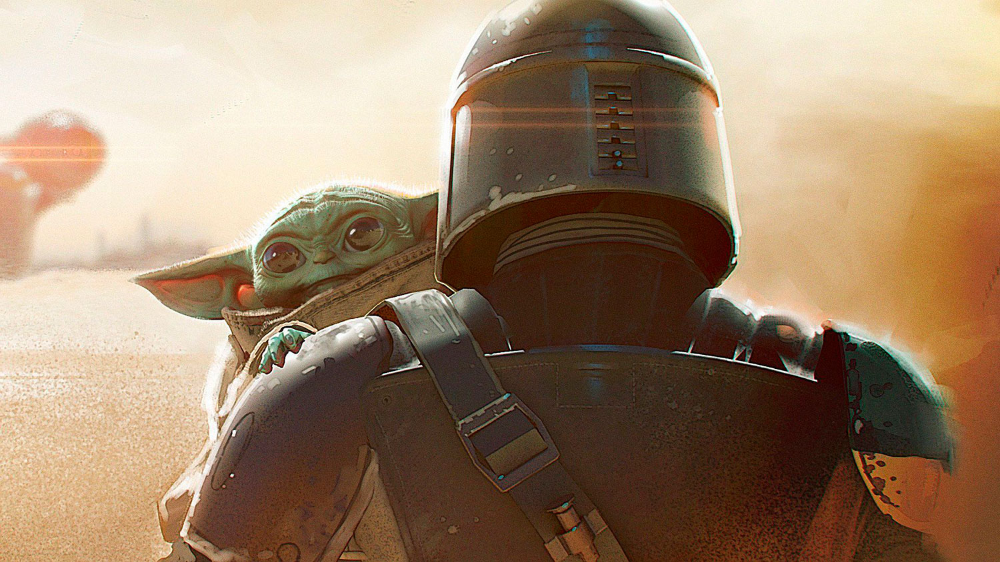

# Star of "Mandalorez" Giancarlo Esposito hinted at the plot of future seasons of the series.

In an interview with the magazine People Giancarlo Esposito told what to expect from future seasons of the series "Mandalorec. Performer of the role of Moffa Gideon did not reveal details, but said that viewers will start receiving answers only in the third and fourth seasons.

"The next season of "Mandalorec" will be very interesting, because you will start to learn about the power of a child, what really means a child," says Esposito. - You'll also start to learn about the origin of the dark sword that Moff Gideon has, and how it relates to the past of Star Wars, Clone Wars and other projects.

"And you will start to understand the scale of 'Star Wars'," continues the actor. - We live in a huge universe, in which so much has not yet been explored. So, I think the series will begin to lay the foundation for the scale, which will appear in seasons three and four, when you really start to get answers".

The plot of the second season of "Mandalorets" is not disclosed. According to the trailer, the bounty hunter will go to the most dangerous corners of the distant galaxy to find Jedi and learn about the origin of Little Yod. Moff Gideon, a high-ranking imperial officer, will continue to be Mandaloretz's main enemy. The series will return to the screens on October 30.

# "Mandaloretz" took "Emmy" in technical categories. The series was awarded for the effects and work of the operator.

The main Emmy Award ceremony will take place on September 20, and meanwhile the American Television Academy is giving prizes for technical achievements. This year the leaders are "Mandalorets" and "Guardians". The Disney+ project has already taken five statuettes, and the HBO series - four.

"Mandalorets" was awarded for the work of the artist and sound editing in the first and second episodes. Greg Fraser was awarded a prize for best cameraman work (for the seventh episode), and the episode "The Child" was awarded for best special effects.

"The Guardians won in the following areas: sound mixing (the episode "This amazing creature"), editing (the episode "God walks into a bar"), costumes in fantasy/fantasy (the episode "It's summer and we're running out of ice") and camera work (Gregory Middleton, the episode "This amazing creature").

In total, the Guardians have collected 26 Emmy nominations and the Mandalorec 15. Among other things, the first series qualifies for a prize in the category "Best Mini-Series", and the second series can take an award as the best drama series.

"Mandalorec" will return to the screens with the second season on October 30.
